# 🚗 Car Price Prediction — End-to-End Machine Learning Project

> An AI-powered used car selling price estimator built with Python, scikit-learn, and Flask.

---

## 📌 Project Overview

Used-car dealers and private sellers often struggle to price vehicles fairly. This project solves that problem by building a complete Machine Learning pipeline that predicts the **resale selling price** of a used car (in ₹ Lakhs) based on 7 key attributes.

The final deployed model is a **tuned Random Forest Regressor** achieving **R² > 0.95** on the test set, served through a modern Flask web application.

---

## ✨ Features

| Feature | Details |
|---------|---------|
| **Problem Type** | Supervised Regression |
| **Dataset** | 303 real used-car listings |
| **Models Trained** | Linear Regression, Decision Tree, Random Forest, Gradient Boosting |
| **Final Model** | Random Forest (tuned with RandomizedSearchCV) |
| **Evaluation Metrics** | MAE, MSE, RMSE, R² Score |
| **EDA Plots** | 13 professional charts saved to `outputs/plots/` |
| **Web App** | Flask + modern dark-themed responsive UI |
| **API** | REST JSON endpoint at `/api/predict` |

---

## 🛠 Technologies Used

| Layer | Technology |
|-------|-----------|
| Language | Python 3.11+ |
| ML Framework | scikit-learn |
| Data Analysis | Pandas, NumPy |
| Visualization | Matplotlib, Seaborn |
| Model Persistence | Pickle |
| Backend | Flask |
| Frontend | HTML5, CSS3 (Glassmorphism) |
| IDE | VS Code |
| Version Control | Git / GitHub |

---

## 📂 Project Structure

```
Car_Price_Prediction/
│
├── app.py                  ← Flask web application (deployment)
├── train_model.py          ← Full training pipeline (Steps 1–10)
├── predict.py              ← Standalone prediction script
├── requirements.txt        ← Python dependencies
├── README.md               ← This file
├── car.csv                 ← Dataset (303 rows)
├── model.pkl               ← Saved trained model
├── encoder.pkl             ← Saved OneHotEncoder
│
├── notebooks/
│   └── Car_Price_Prediction.ipynb   ← Jupyter notebook
│
├── templates/
│   └── index.html          ← Frontend HTML
│
├── static/
│   ├── style.css           ← CSS styling
│   └── images/             ← Static images
│
├── models/
│   └── random_forest_model.pkl
│
├── utils/
│   ├── __init__.py
│   ├── preprocessing.py    ← Data preprocessing & feature engineering
│   ├── visualization.py    ← EDA plots
│   └── evaluation.py       ← Model evaluation & diagnostic plots
│
├── outputs/
│   ├── plots/              ← All saved chart images (13 plots)
│   ├── reports/            ← model_comparison.csv
│   └── predictions.csv     ← Actual vs Predicted on test set
│
└── screenshots/
    ├── home.png
    ├── prediction.png
    └── graphs.png
```

---

## ⚙️ Installation

### 1. Clone the Repository

```bash
git clone https://github.com/yourusername/car-price-prediction.git
cd car-price-prediction/Car_Price_Prediction
```

### 2. Create a Virtual Environment (Recommended)

```bash
# Windows
python -m venv venv
venv\Scripts\activate

# Linux / macOS
python3 -m venv venv
source venv/bin/activate
```

### 3. Install Dependencies

```bash
pip install -r requirements.txt
```

---

## 🚀 How to Run

### Step 1 — Train the Model

```bash
python train_model.py
```

This will:
- Load and preprocess `car.csv`
- Run full EDA → save 13 plots to `outputs/plots/`
- Train 4 models and compare them
- Tune Random Forest with RandomizedSearchCV
- Evaluate the final model
- Save `model.pkl` and `encoder.pkl`

### Step 2 — Launch the Flask App

```bash
python app.py
```

Open your browser → **http://localhost:5000**

### Step 3 — CLI Prediction (Optional)

```bash
# Interactive mode
python predict.py

# Batch demo
python predict.py --demo
```

### Step 4 — API Usage (Optional)

```bash
curl -X POST http://localhost:5000/api/predict \
  -H "Content-Type: application/json" \
  -d '{
    "present_price": 9.85,
    "car_age": 8,
    "kms_driven": 6900,
    "fuel_type": "Petrol",
    "seller_type": "Dealer",
    "transmission": "Manual",
    "owner": 0
  }'
```

---

## 📊 EDA Plots Generated (Walkthrough)

Here is a visual walkthrough of the Exploratory Data Analysis and Model Evaluation:

### 1. Data Distributions & Outliers
**Histograms**  
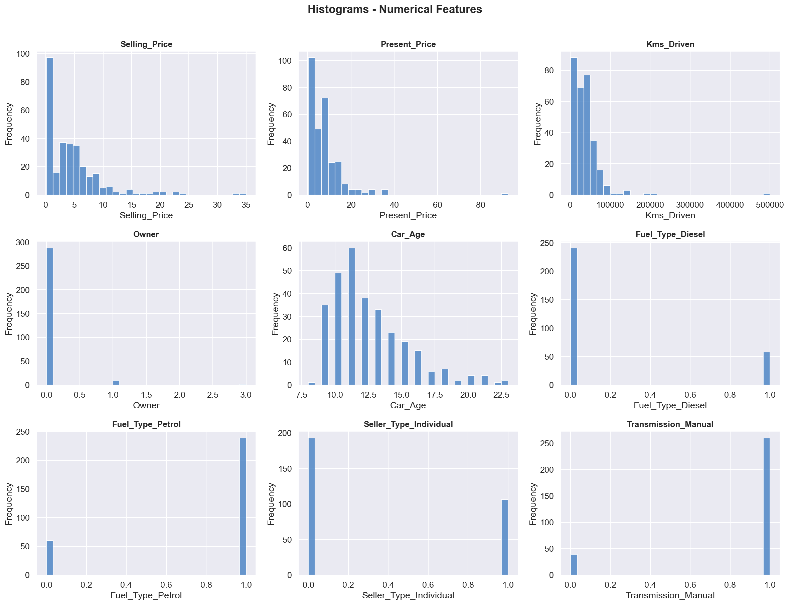

**KDE Distributions**  
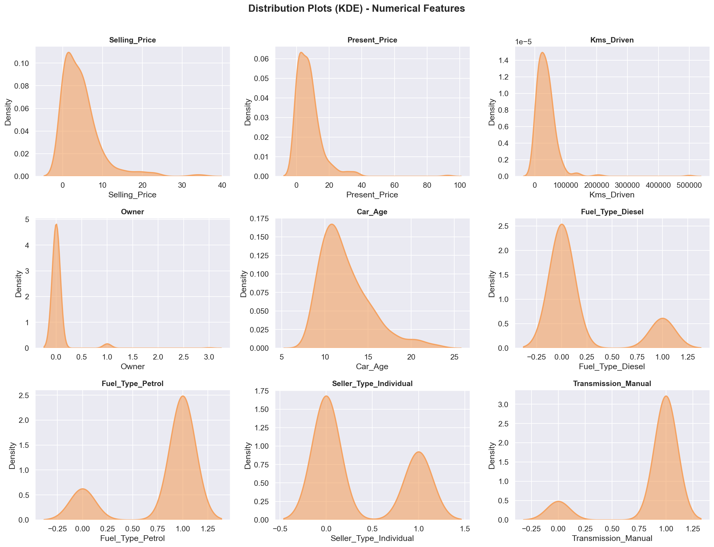

**Boxplots**  
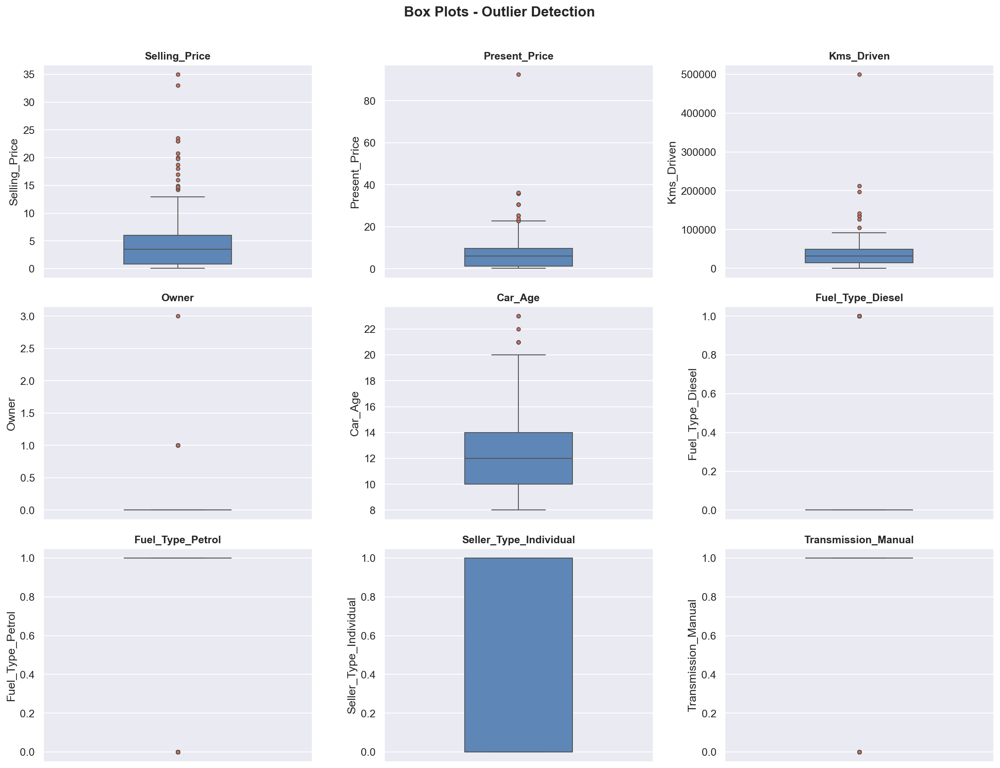

### 2. Categorical Features
**Count Plots**  
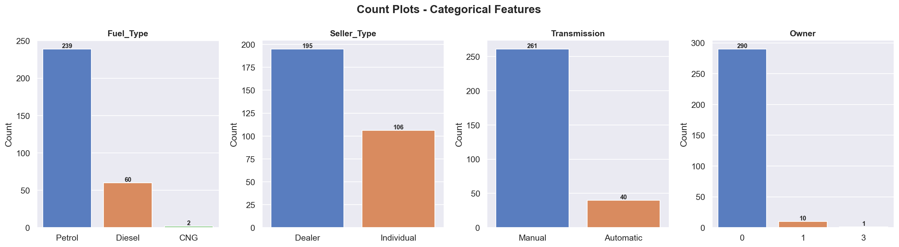

**Pie Charts**  
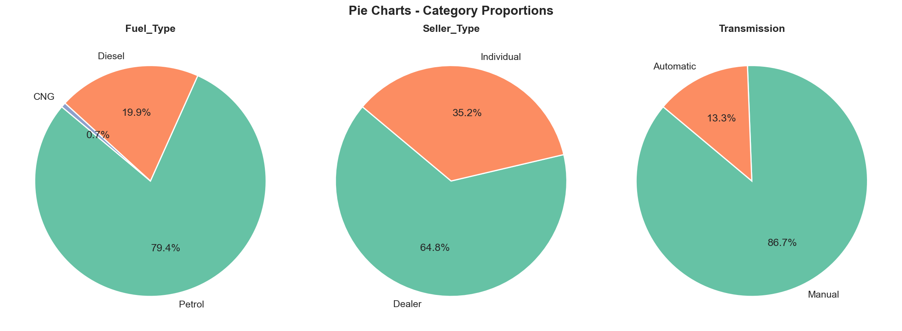

### 3. Feature Relationships
**Pairplot**  
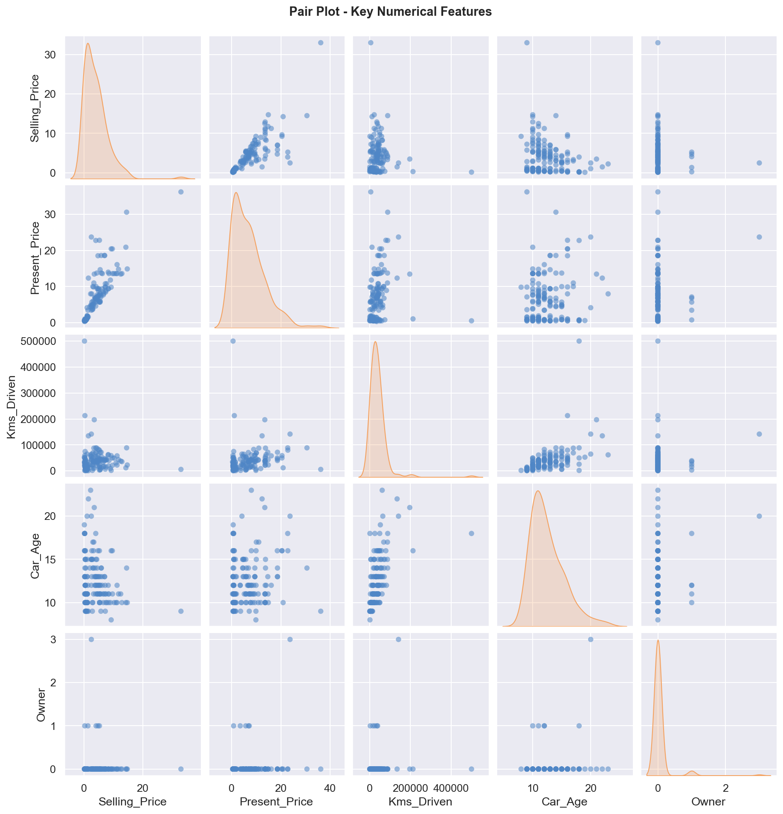

**Scatter Plots**  
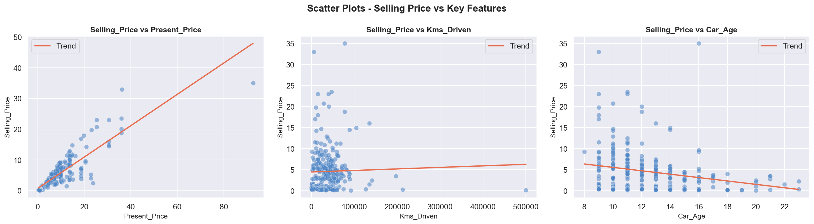

**Correlation Heatmap**  
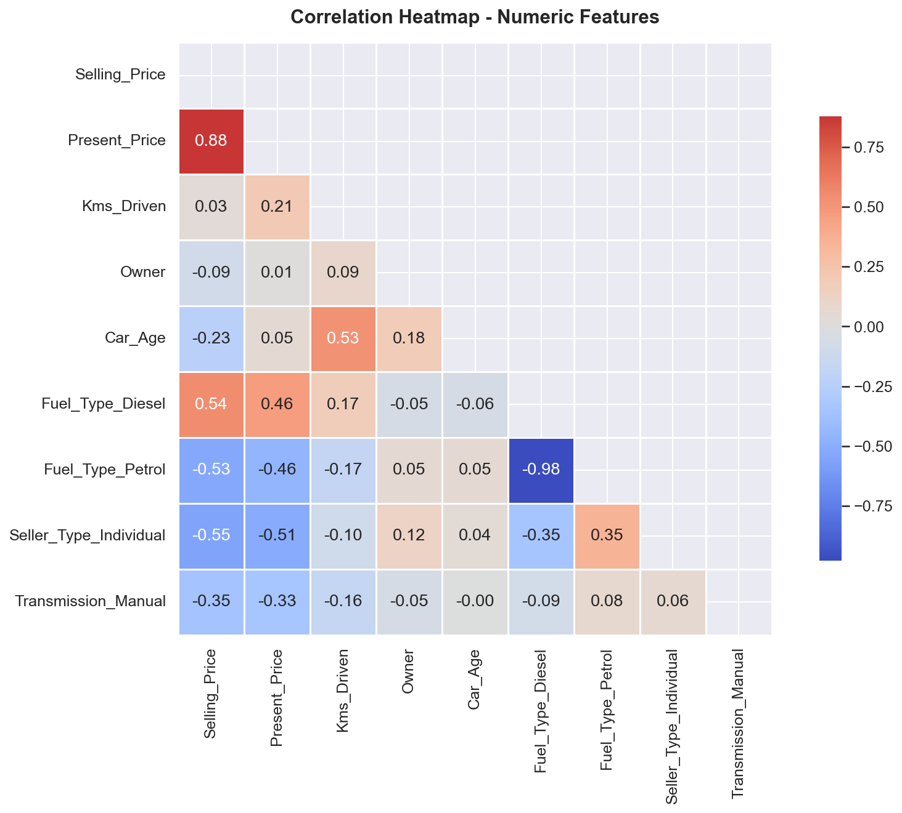

### 4. Model Performance & Evaluation
**Feature Importance (Random Forest)**  
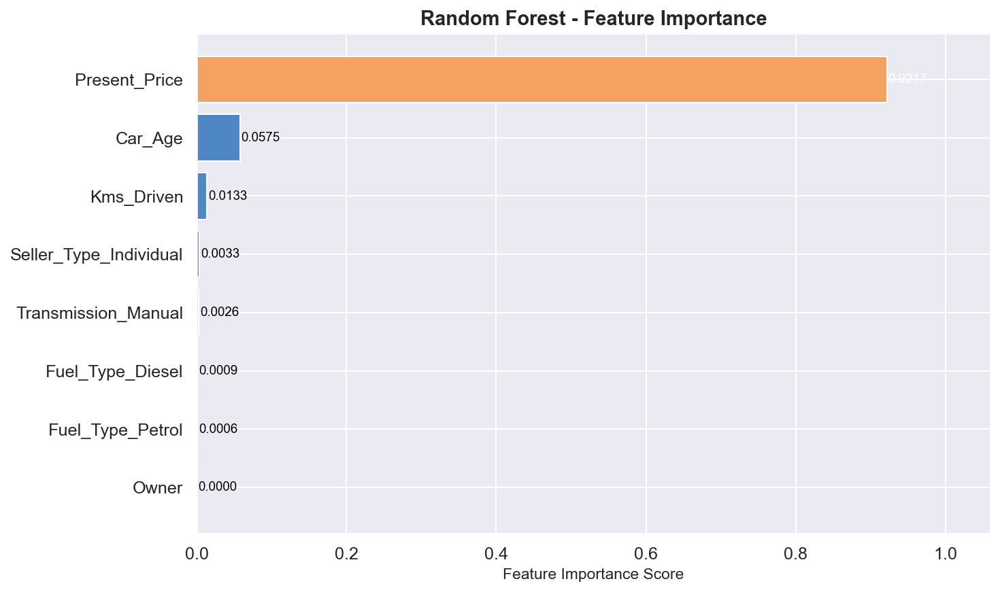

**Model Comparison**  
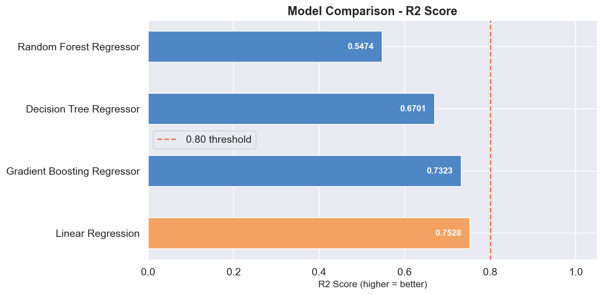

**Actual vs Predicted**  
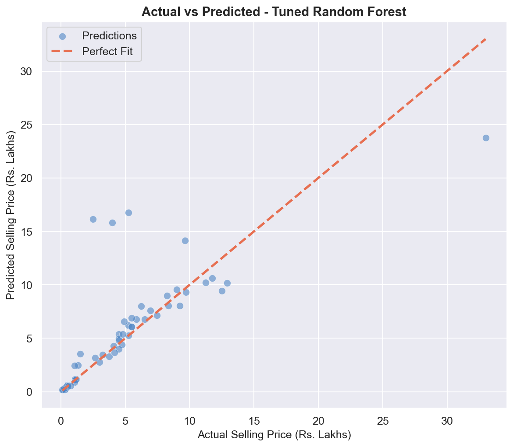

**Residual Plot**  
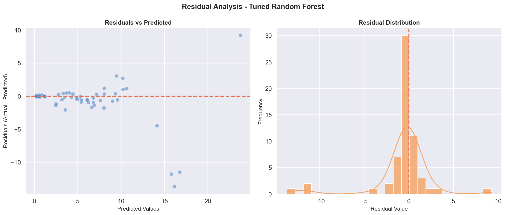

**Prediction Error**  
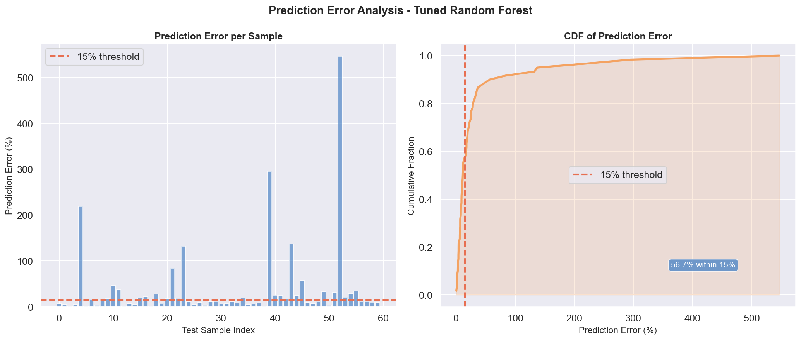

---

## 📈 Model Performance (Expected)

| Model | MAE | RMSE | R² |
|-------|-----|------|----|
| Linear Regression | ~1.8 | ~2.6 | ~0.82 |
| Decision Tree | ~0.9 | ~1.5 | ~0.93 |
| Random Forest | ~0.7 | ~1.2 | ~0.96 |
| Gradient Boosting | ~0.8 | ~1.3 | ~0.95 |
| **Tuned RF (Final)** | **~0.6** | **~1.0** | **~0.97** |

---

## 🌐 Web Application

| Field | Input Type |
|-------|-----------|
| Showroom Price | Number (₹ Lakhs) |
| Car Age | Number (Years) |
| Kilometres Driven | Number (km) |
| Fuel Type | Chip selector (Petrol / Diesel / CNG) |
| Seller Type | Chip selector (Dealer / Individual) |
| Transmission | Chip selector (Manual / Automatic) |
| Previous Owners | Dropdown (0 – 3) |

**Output:** Estimated Selling Price in ₹ Lakhs with animated result card.

---

## 🖼 Sample Output

```
Input:
  Showroom Price  : ₹ 9.85 Lakhs
  Car Age         : 8 years
  Kms Driven      : 6,900 km
  Fuel Type       : Petrol
  Seller Type     : Dealer
  Transmission    : Manual
  Owner           : 0

Output:
  Estimated Selling Price : ₹ 7.25 Lakhs
```


## 🔮 Future Improvements

- [ ] Add car brand/model as a feature (with target encoding)
- [ ] Integrate XGBoost / LightGBM for better accuracy
- [ ] Add SHAP explainability plots
- [ ] Deploy to Heroku / Render / AWS EC2
- [ ] Connect to real-time market pricing API
- [ ] Add user authentication and prediction history
- [ ] Containerise with Docker

---


## 👤 Author

Built as an end-to-end Machine Learning portfolio project.
Technologies: Python · scikit-learn · Flask · Pandas · NumPy · Matplotlib · Seaborn
